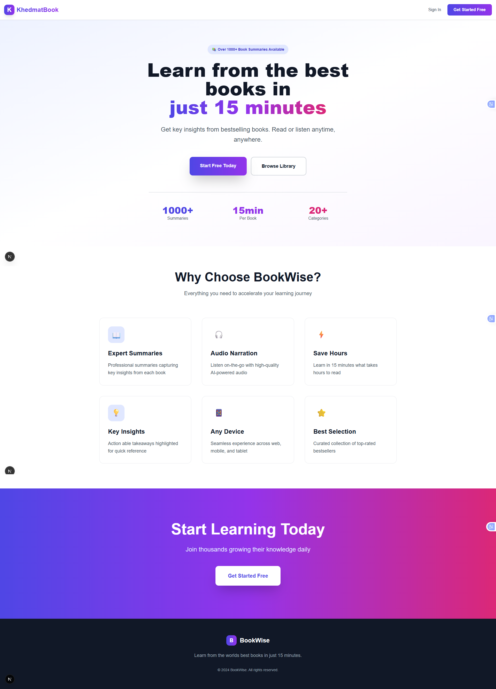
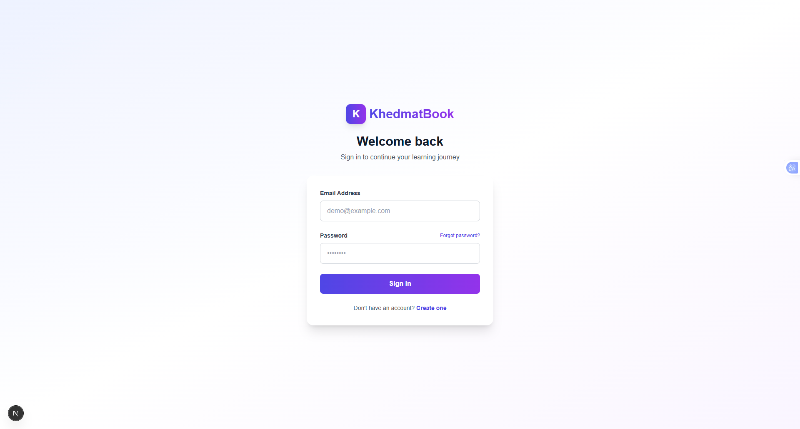
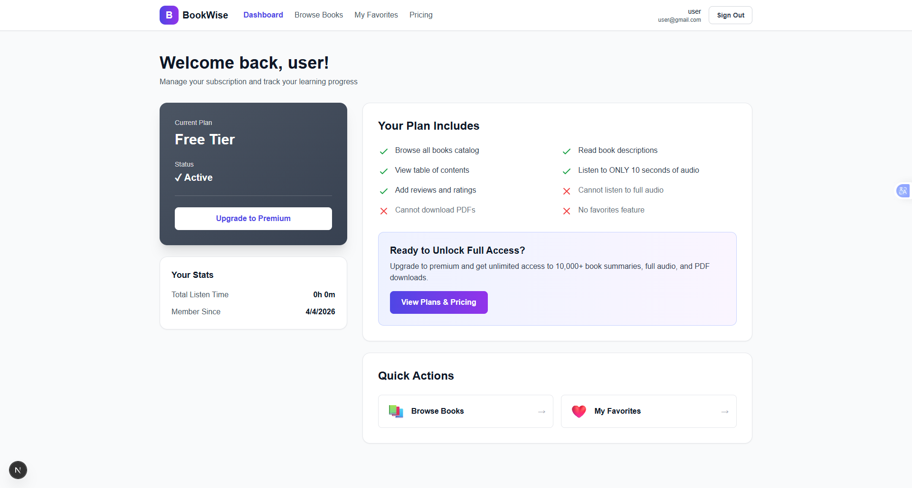

# 🚀 ai-saas-project-with-nextjs

A modern, scalable **SaaS web application** built with **Next.js**, designed to deliver high performance, clean UI, and a great user experience.

---

## 🌐 Live Demo

<!-- 👉 https://your-live-url.com -->

---

## 📸 Screenshots


### Frontend of Project



### User Login Page 



### User Dashboard



---

## ✨ Features

* 🔐 Secure Authentication (Login / Register)
* 📊 User Dashboard with real-time data
* ⚡ Fast performance with Next.js
* 🎨 Clean and responsive UI
* 🌍 SEO optimized pages
* 🔄 API integration
* 🧩 Modular and scalable architecture

---

## 🛠 Tech Stack

* **Frontend:** Next.js, React
* **Styling:** Tailwind CSS / Sass
* **Backend:** Next.js API Routes
* **Database:** (Add yours: MongoDB / PostgreSQL / MySQL)
* **Authentication:** (NextAuth / Custom Auth)
* **Deployment:** Vercel / Netlify / VPS

---

## 📂 Project Structure

```
├── app / pages
├── components
├── public
│   └── screenshots
├── styles
├── utils
└── api
```

---

## ⚙️ Installation & Setup

Clone the project:

```bash
git clone https://github.com/alawoddin/ai-saas-project-with-nextjs.git
```

Go to the project directory:

```bash
cd your-repo
```

Install dependencies:

```bash
npm install
```

Run the development server:

```bash
npm run dev
```

Open in browser:

```
http://localhost:3000
```

---

## 🔐 Environment Variables

Create a `.env.local` file and add:

```
NEXT_PUBLIC_API_URL=your_api_url
DATABASE_URL=your_database_url
AUTH_SECRET=your_secret_key
```

---

## 🚀 Deployment

The easiest way to deploy this app is using **Vercel**:

1. Push your project to GitHub
2. Import into Vercel
3. Set environment variables
4. Deploy 🚀

---

## 🤝 Contributing

Contributions are welcome!
Feel free to fork the project and submit a pull request.

---

## 📄 License

This project is licensed under the MIT License.

---

## 👨‍💻 Author

Developed by **Your Name**

* GitHub: https://github.com/alawoddin/ai-saas-project-with-nextjs.git
* Email: [alawoddin](mailto:alawoddinkhan84@gmail.com)

---

## ⭐ Support

If you like this project, give it a ⭐ on GitHub — it helps a lot!
